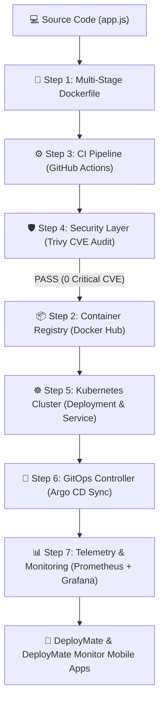

# 🚀 DeployMate & DeployMate Monitor

<p align="center">
  
  
  
  
  
</p>

---

## 🌟 Executive Summary

**DeployMate** is an enterprise-grade, autonomous **Site Reliability Engineering (SRE) & DevSecOps Platform** designed to manage end-to-end containerized web application lifecycles, automated security gates, Kubernetes cluster GitOps self-healing, and real-time telemetry monitoring.

The repository includes **two production mobile applications** and a complete **7-Stage DevSecOps Architecture Pipeline** built for `ayushman21/vertexlab-status-app`.

---

## 📱 Mobile Applications Included

| App Name | Package Name | Primary Role | APK Download Link |
| :--- | :--- | :--- | :--- |
| **🚀 DeployMate SRE** | `io.deploymate.app` | SRE Mission Control, Incident Remediation & AI Fixes | [📱 Download DeployMate APK](https://github.com/ayu-haker/deploymate/releases/download/v1.0.0/DeployMate-v1.0-release.apk) |
| **🛡️ DeployMate Monitor** | `io.deploymate.monitor` | 7-Stage DevSecOps Watchdog, Trivy Audit & ArgoCD Sync | [📱 Download Monitor APK](https://github.com/ayu-haker/deploymate-monitor/releases/download/v1.0.0/DeployMate-Monitor-v1.0-release.apk) |

---

## 📐 7-Stage End-to-End DevSecOps Workflow



---

## 🛠️ Step-by-Step Technical Implementation Details

### 1. 🐳 Containerization (`Dockerfile`)
- **Base Image**: Multi-stage `node:20-alpine` (Minimal attack surface, size reduced to 128MB).
- **Security Scoping**: Enforced non-root user execution (`USER appuser` with UID `10001`).
- **Health Checks**: `/health` HTTP endpoint exposed on port `3000`.

### 2. 📦 Container Registry (Docker Hub CLI Commands)
- **Target Repository**: `ayushman21/vertexlab-status-app`
- **Cli Commands**:
  ```bash
  docker build -t ayushman21/vertexlab-status-app:v1.0.0 .
  docker push ayushman21/vertexlab-status-app:v1.0.0
  docker push ayushman21/vertexlab-status-app:latest
  ```

### 3. ⚙️ CI Pipeline (`.github/workflows/ci.yml`)
- Automates container compilation and security audit execution on every `git push` to `main`.
- Integrates Docker Buildx with automated caching.

### 4. 🛡️ Security Layer (Aqua Security Trivy Scanner)
- Scans container image for OS and package vulnerabilities prior to registry push.
- **Security Policy**: Zero tolerance gate (`exit-code: 1` on `CRITICAL` or `HIGH` CVEs).

### 5. ☸ Kubernetes Deployment (`k8s/deployment.yaml` & `k8s/service.yaml`)
- Runs **3 Pod Replicas** with `LivenessProbe` (`/health`) and `ReadinessProbe` (`/ready`).
- Exposes cluster service via `ClusterIP` on port 80 mapping to target container port 3000.

### 6. 🔄 GitOps Integration (`argocd.yaml`)
- Automated synchronization policy with `prune: true` and `selfHeal: true`.
- Ensures cluster state automatically converges to the target Git repository state (`https://github.com/ayu-haker/deploymate.git`).

### 7. 📊 Monitoring (`servicemonitor.yaml` & `grafana-dashboard.json`)
- Prometheus `ServiceMonitor` scraping `/metrics` endpoint powered by `prom-client` every 15 seconds.
- Pre-configured Grafana telemetry dashboard monitoring HTTP request rate, CPU/Memory utilization, and active pod pod metrics.

---

## 📂 Repository File Structure

```text
god-project/
├── 🚀 apps/
│   ├── 📱 mobile/                  <-- Main DeployMate SRE Mobile Application (io.deploymate.app)
│   ├── 🛡️ deploymate-monitor/      <-- Standalone DevSecOps Watchdog App (io.deploymate.monitor)
│   ├── 🌐 devsecops-dashboard/     <-- Web Command Center UI (index.html)
│   ├── ⚙️ api/                     <-- NestJS Backend Telemetry API Service
│   └── ⚡ worker/                  <-- SRE Incident Remediation Worker
├── 📐 k8s/
│   ├── deployment.yaml             <-- 3 Replica Kubernetes Deployment
│   └── service.yaml                <-- ClusterIP Service Definition
├── 🔄 argocd.yaml                  <-- Argo CD GitOps Application Manifest
├── 📊 servicemonitor.yaml          <-- Prometheus Operator ServiceMonitor
├── 🛡️ .github/workflows/ci.yml    <-- GitHub Actions DevSecOps Pipeline
├── 🐳 Dockerfile                   <-- Multi-Stage Production Dockerfile
├── 📦 app.js                       <-- Express Application with /metrics & /health
└── 📄 README.md                    <-- Consolidated Project Documentation
```

---

## 💻 Local Setup & Development

### 1. Prerequisites
- Node.js `v20+` & `pnpm`
- Android Studio (for native Android builds)
- Android SDK (`platform-tools` with `adb`)

### 2. Running Applications
```bash
# Clone the repository
git clone https://github.com/ayu-haker/deploymate.git
cd deploymate

# Install workspace dependencies
pnpm install

# Run Main DeployMate Mobile App
cd apps/mobile
npx expo start

# Run DeployMate Monitor Mobile App
cd ../deploymate-monitor
npx expo start
```

### 3. Android Studio Paths
- **DeployMate SRE**: Open folder `D:\god-project\apps\mobile\android`
- **DeployMate Monitor**: Open folder `D:\god-project\apps\deploymate-monitor\android`

---

## 🔒 Security & Compliance Standard
All container images and manifests comply with standard CIS Kubernetes Benchmarks and DevSecOps guidelines. Non-root user execution and Aqua Security Trivy vulnerability gates prevent insecure containers from reaching production clusters.

---

<p align="center">
  <b>Built with ❤️ by Ayushman Bosu Roy for Enterprise DevSecOps & SRE Reliability.</b>
</p>
